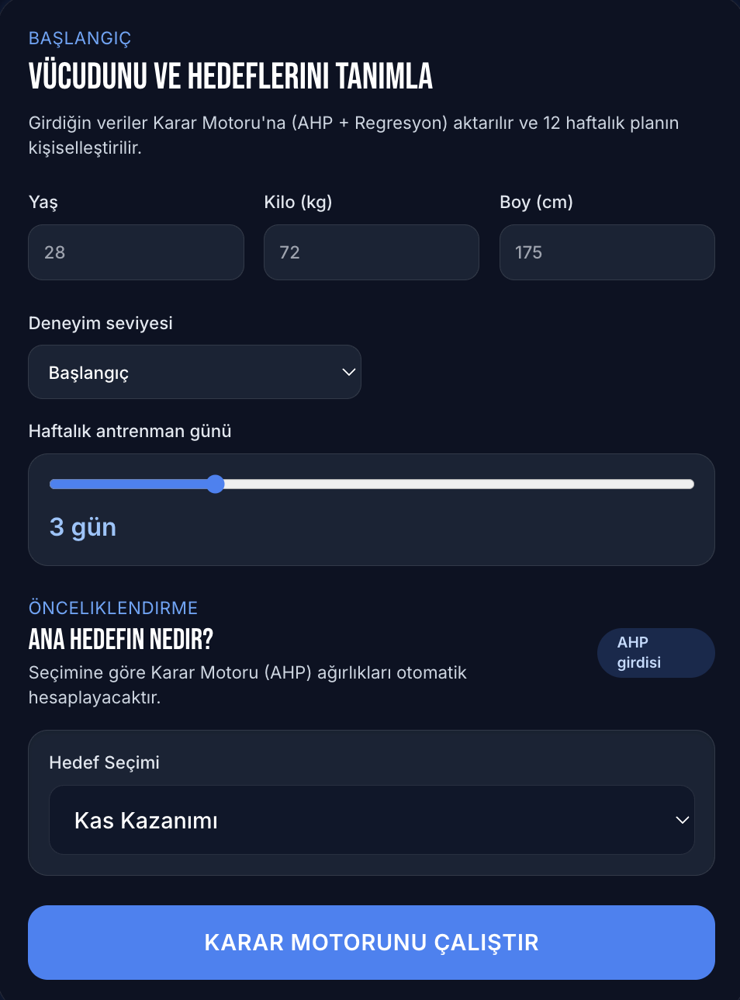
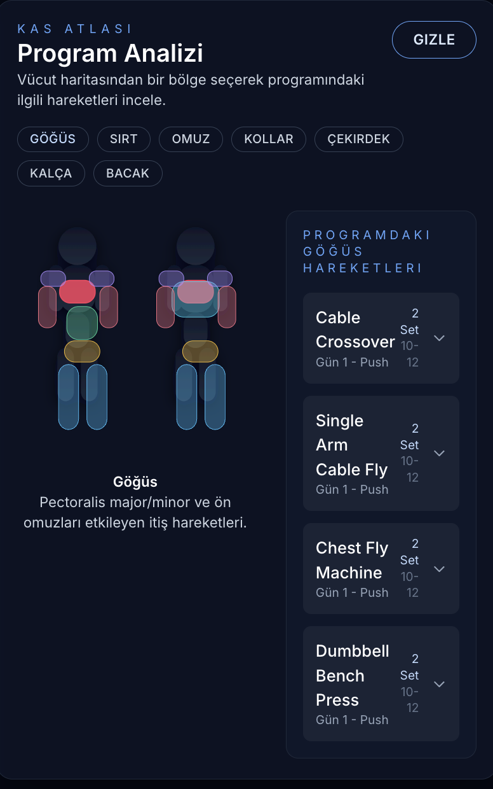
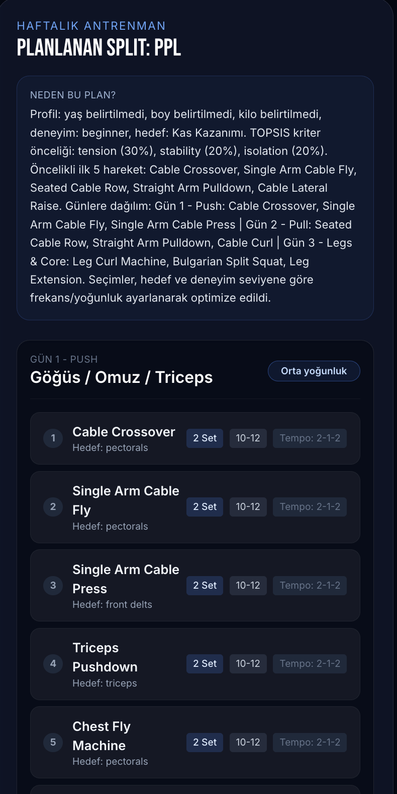

# Fitness DSS – Kişiselleştirilmiş Antrenman Planlayıcı

Kullanıcının yaş, boy, kilo, deneyim ve hedeflerine göre **AHP + TOPSIS** tabanlı karar motoruyla haftalık antrenman planı oluşturan bir React uygulaması. Vücut haritası üzerinden bölgesel egzersiz önerileri sunar, otomatik split (Push/Pull/Legs, Upper/Lower, Full Body) algılar ve her güne yoğunluk/set/tekrar şeması ekler.

## Canlı Demo

[Projeyi canlı görüntüle](https://kds-fitness-projesi.vercel.app/)

## Ekran Görüntüleri

- 
- 
- 

## Özellikler

- **Karar destek motoru:** Kullanıcı hedeflerini (Kas kazanımı, Yağ kaybı, Dayanıklılık) AHP ile ağırlıklandırır, egzersizleri TOPSIS ile skorlar.
  > - **Profil tabanlı optimizasyon:** Yaş, BMI ve deneyime göre set/tekrar/tempo ve yoğunluk otomatik ayarlanır.
- **Split algılama:** Planın içeriğine göre otomatik PPL, Upper/Lower veya Full Body etiketi üretir.
- **Vücut haritası:** SVG kas haritası üzerinden bölge seçimi ve gün bazlı egzersiz listesi.
- **Açıklama üretimi:** Karar kriterleri, seçilen ilk hareketler ve günlük dağılım için özet açıklama.
- **Mock veri:** `src/data/mockExercises.js` içindeki egzersiz havuzuna kolayca ekleme/çıkarma yapılabilir.

## Teknolojiler

- React 19 + Vite
- Tailwind CSS
- Zustand (state yönetimi için hazır, ihtiyaç halinde)
- simple-statistics (hesaplamalar), Recharts (grafikler için hazır), Axios

## Kurulum

```bash
git clone <repo-url>
cd KDSFitnessProjesi
npm install
npm run dev
```

Geliştirme sunucusu genellikle `http://localhost:5173` üzerinde açılır.

## Kullanım

1. Yaş, boy, kilo, deneyim ve haftalık antrenman gün sayısını gir.
2. Ana hedefini seç (AHP ağırlıkları otomatik hesaplanır).
3. “Karar Motorunu Çalıştır” butonuna bas; sistem egzersizleri skorlayıp günlere dağıtır.
4. Haftalık plan kartından split özetini ve gün/gün hareketleri incele.
5. Vücut haritası üzerinden bölge seçerek ilgili günlerin hareketlerini ve GIF’leri görüntüle.

## Mimarinin Kısa Özeti

- `src/services/exerciseService.js`: Egzersiz normalizasyonu, TOPSIS sıralaması, split şablonları ve açıklama üretimi.
- `src/utils/ahpLogic.js`: AHP matrisleri ve tutarlılık hesabı.
- `src/components/forms/UserProfileForm.jsx`: Profil/öncelik formu.
- `src/components/dashboard/WeeklyPlan.jsx`: Split algısı, haftalık plan listesi.
- `src/components/dashboard/RegionalExerciseSelector.jsx`: Vücut haritası, bölgesel egzersiz listesi.
- `src/data/mockExercises.js`: Egzersiz havuzu.

## Özelleştirme İpuçları

- **Egzersiz havuzu:** Yeni hareket eklemek için `src/data/mockExercises.js` dosyasına `targetMuscles`, `bodyPart` ve `equipment` alanlarıyla obje ekle.
- **Split şablonları:** `exerciseService.js` içindeki `TOPSIS_DAY_TEMPLATES` ve `AVAILABILITY_PATTERNS` ile gün sayısı/odak dağılımını değiştir.
- **Yoğunluk şeması:** `deriveRepSchemeFromProfile` fonksiyonu yaş/BMI/deneyime göre set–tekrar–tempo kurallarını tanımlar.

## Katkıda Bulunanlar

- Umut Şen
- Berkay Kozar
- Emre Göktuğ Türk

## Lisans

Bu repo için uygun lisans bilgisini ekleyin (ör. MIT, Apache-2.0).
